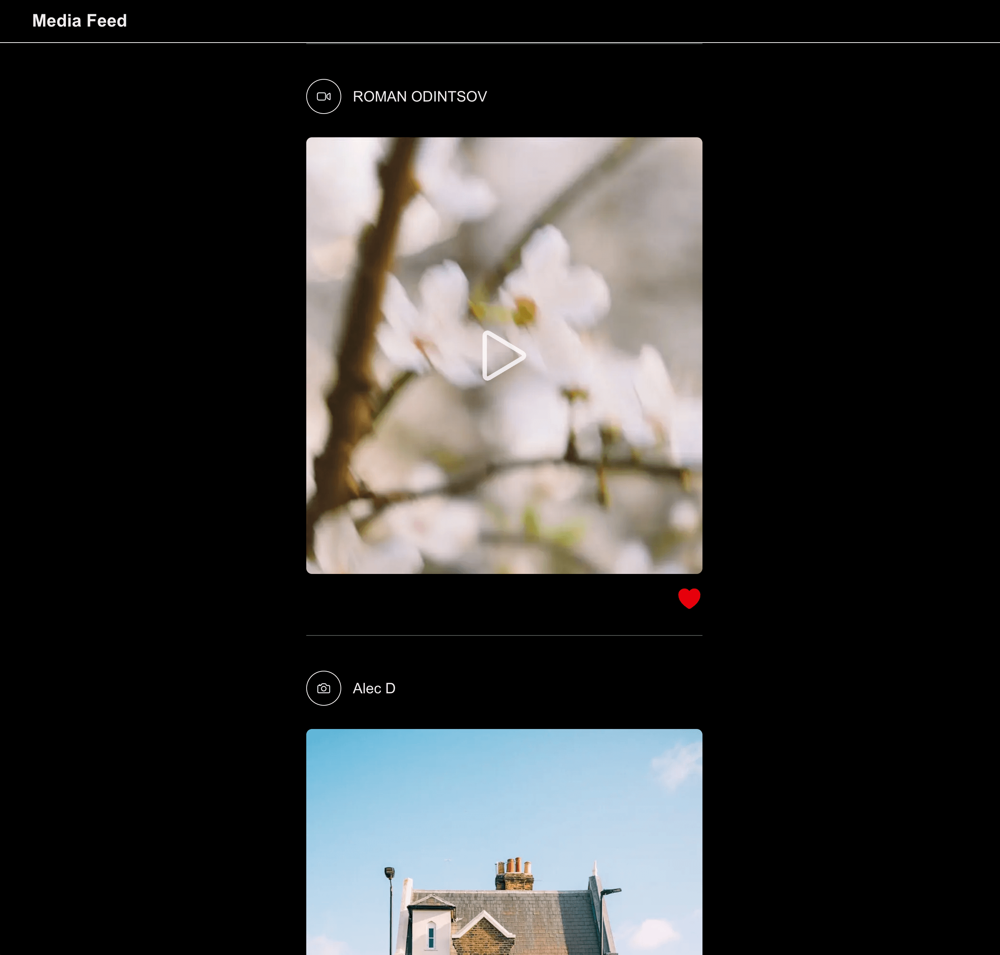

# 📸 Media Feed – Social Feed Powered by Pexels

Live demo: https://media-feed-test.vercel.app/



An infinite-scrolling media feed featuring curated photos and videos from Pexels using the Pexels API (https://www.pexels.com/api/documentation).

## Features

- Next.js 15 + App Router + Server Components
- Type-safe infinite scroll with custom `useAsync` hook
- Full-screen modal with native `<dialog>`
- Hover to preload video, UX animations, responsive layout
- Skeleton loaders, image optimization

## Why Pexels?

Flickr now requires a paid Pro account for API access. Switched to Pexels (free, unlimited, supports videos) while preserving the original spec.

## Run locally

```bash
cp .env.example .env

# add your Pexels API key from https://www.pexels.com/api/

npm install
npm run dev
```
